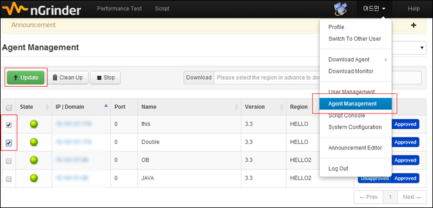
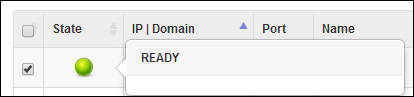

>From nGrinder 3.3, the agent is self-updatable by the controller’s update command. This guide shows how to update agents.

If you’re using nGrinder 3.3 or later controller and agent, you don’t need to open the telnet client to the each agent machine when you need to update the agent into newer version. Just follow the step below.

1. Just go to the agent management page. You can see the attached agent list.
2. Select the agents to be updated and click “Update” button. The ball on the left side will be blicked while the updating is being progressed.  
   
3. Then the update will be finished about 20~40 seconds after. Please make sure that your agent status READY again.

     

The agent update is workable only when following constraints are met.

1. Only one agent runs per a machine.  
   When you have run more than two agents using same agent command in a single machine, the update command will affect the both agents. It makes the update processing confused.  
   To avoid this, you should click update button for each agent sequentially or install the agent in the different folder in a single machine.
2. The controller version should be higher than the agent version.  
   The agent will ignore the update command if the previous version is sent. So always make sure that your controller is the later version.
3. The version of already installed agent should be 3.3 or later.  
   The agent before 3.3 version will not be updated. You should re-install such agents by yourself.
