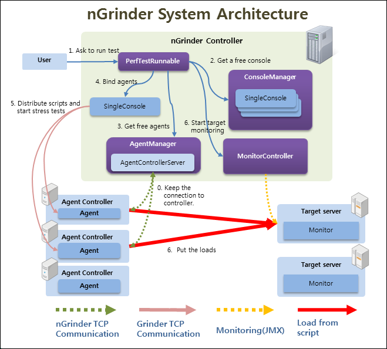
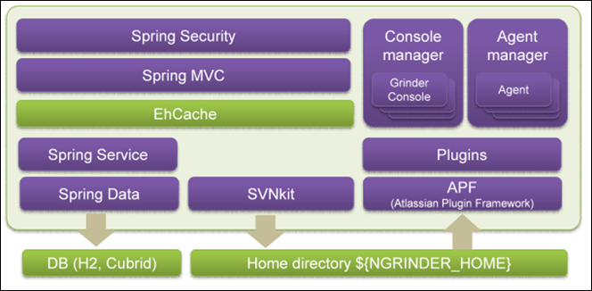
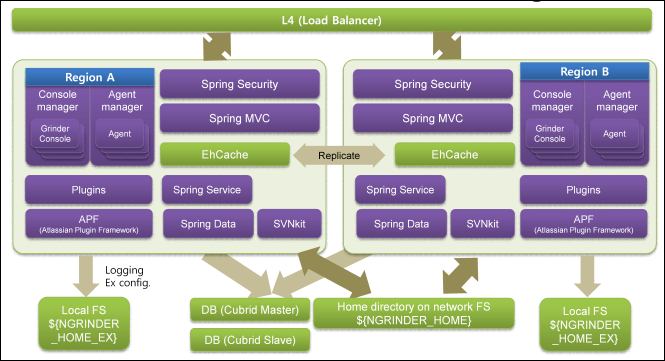

# Philosophy
- Reliability over Accuracy
- TPS over VUser
- Code is always better than GUI Editor
- Do not limit!!
- File System is faster than DB if we use it correctly.
- Convention over Configuration
- Open Closed policy by Plugin Model
- One shot Installation
- Need to add code? Remove same amount of code first.

# General Architecture
nGrinder is a application for running test scripts written in jython(python running on JVM) across a number of machines. It's internal engine is based on Grinder. nGrinder wraps Grinder's console and agent with a controller and agent, respectively, and extends several features to enable multiple concurrent tests.

nGrinder consists of two major components.
> - Controller
	- Provides web interface for performance testing.
	- Coordinates test processes.
	- Collates and displays test statistics.
	- Let user create and modify script .
> - Agent
	- Runs processes and threads that put loads on target machines when running in agent mode.
	- Monitors target system performance (e.g.: CPU/memory) when running in monitor mode

When agents are started, they attempt to connect to a controller. They then are attached in AgentControllerServer component. AgentControllerServer(Which is like an agent pool) manages the current agent pool. Whenever a user starts a performance test, a new console that coordinates agents is created, and the required number of agents is handed over from AgentControllerServer. The console (named SingleConsole to differentiate it from Console in Grinder) sends the test script and test resources to multiple assigned agents and starts to control the test flow until the test is over. After the test is finished, the used agents are returned to AgentControllerServer to be used in the other tests later. SingleConsole is returned to ConsoleManager as well.

The biggest difference between nGrinder and Grinder is that nGrinder keeps multiple console instances and agents in the controller. Each console is independent from the others, and all can run concurrently. Many agents can be attached in advance, and can be assigned whenever they are requested. Unlike grinder, nGrinder is developed to maximize utilization for agents machines.

Well-known load test tools such as "Performance Center" have a test reservation feature to guarantee agent availability when a user starts a test. But the reservation approach causes an agent utilization problem. We observed that people tend to reserve agents as a precaution even while they are actually not testing. In our experience, the average agent CPU utilization is less than 10% as a result.

For this reason, instead of reservation, **nGrinder enables multiple test and dynamic agent allocation** so that agents are dynamically assigned to tests only when a real test is performed. This makes nGrinder a unique solution among all competitors. With a relatively small number of agents, multiple users can run multiple tests concurrently. The number of possible concurrent tests depends on the number of free agents.

# Cluster Architecture
From nGrinder version 3.1, we introduced nGrinder controller clustering, which make the performance test can be executed by one of the clustered controller and support multiple set of agents(named region) to be used.

Below is the architecture without cluster supports.

1. nGrinder uses an embedded svn server(SVNKit DAV) to manage script files. The svn repositories are stored in ${NGRINDER_HOME} directory.
2. nGrinder uses EhCache to improve the data retrieval performance from DB and SVN repositories.
3. nGrinder uses Spring Security to protect the system and uses Atlassian Plugin Framework for extensibility.

If you enable clustering mode by configuring the system.conf (See link) and install nGrinder into multiple machine, the system architect is changed as below:

1. All the controllers in the cluster shares the same DB and file system. All ngrinder controller should point same ${NGRINDER_HOME} folder which should be shared by NFS.
2. Each controllers can have its own special properties and log output folder. This information will be saved in ${NGRINDER_EX_HOME} in the each controller.
3. All controllers replicates the EhCache to each other to make some data to be visible in all controllers in cluster.

Each controller can serve nGrinder web content equally but handles the different test set depending the region. We don't provide any session clustering by default. So you may suffer login problem because sessions stored in a controller are not replicated to the other controllers. You may need to configure this by referring Tomcat Session Clustering Guide or use the sticky session on L4. If you are not a expert on this, Just let users to connect only one controller. It's the easiest. :-)

How to configure the clustering?
- Check [[Easy Clustering Guide]]
- Check [[Advanced Clustering Guide]]

# Technology Stack
## Client Tier
- **Bootstrap** : Bootstrap has a lot of predefined web style(js, css etc ), it is sleek and intuitive.We uses it span all over the nGrinder web pages.
- **Bootstrap-slider**:Bootstrap-slider is a beauty of Bootstrap UI widgets. We use this for test duration setting in Test Configuration.
- **Jquery** :jQuery is a lightweight JavaScript library,it make much easier to use JS on nGrinder web pages.
- **Jquery Validate** : Jquery Validate is an excellent tool for web pages to validate data entries at the client side.
- **Datatables** : DataTables is a highly flexible JS tool which will add advanced interaction controls to any HTML table.
- **Select2** : Select2 is jQuery based replacement for select boxes which supports searching and infinite scrolling of results.
- **JqPlot** :  jqPlot could generate pure client-side JS charts in web pages and therefore all nGrinder data chart are implemented with JqPlot.
- **CodeMirror** :CodeMirror is an excellent code editor with syntax highlighting in the browser.We use it in nGrinder Script Editor.

## Controller Tier
- **FreeMarker** :FreeMarker is a Java-based template engine focusing on MVC framework and nGrinder web pages is used it as a template engine.
- **Spring Security** :  Spring Security is not only a powerful and highly configurable authentication and access-control framework, but also one of the most mature and widely used security framework. Therefore it protects nGrinder from illegal access.
- **Spring MVC** : Spring MVC provides rich functionality for building robust web applications. nGrinder uses wonderfully its annotation based configuration.
- **GSon** :Gson is a Java library that can be used to convert Java Objects into its JSON representation, and vice versa.
- **SVNKit Dav** : We use this for serving the underlying SVN content thought web.

##Service Tier
- **The Grinder** : Grinder is a java load Testing framework which nGrinder mainly use. Without Grinder, no nGrinder exists
- **Atlassian Plugin Framework** :We use this framework to make the plugin development easier. It's not so heavy weighted and easy to use!
- **Spring**  : Spring Framework provides a comprehensive programming and configuration model for J2ee applications and nGrinder use as a its base architecture. At the first time, we thought Spring is too heavy to adopt. However we choose this because it's the most commonly used framework in our company(Naver) and it was easier to get the help from colleagues. Eventually we're convinced that we can not make nGrinder's rich functionality without highly configurable architecture Spring provides.
- **EhCache** : Ehcache has excellent Spring integration. nGrinder uses this to speed up the data retrieval and to synchronize data between controllers in cluster mode.

## Data Tier
- **Spring Data** :Spring Data simplifies the development of JPA-based data access layer. nGrinder uses RDBMS but this enables the RDBMS access without a single line of SQL.
Hibernate : Hibernate is a powerful technology for persisting data,and it is Spring Data back-end within nGrinder.
- **H2** : H2 is one of two databases nGrinder supports and H2 is used as a default DB.
- **Cubrid** :Cubrid is one of two databases nGrinder supports. It's stable enough and supports HA.
- **Liquibase** : Liquibase is an open source that automates database schema updates. It supports almost all kinds of major databases. However it does not support Cubrid so we had to develop the cubrid driver for Liquibase.
- **SVNKit** : SVNKit is a pure Java toolkit which implements all subversion features and provides APIs to work with Subversion.
