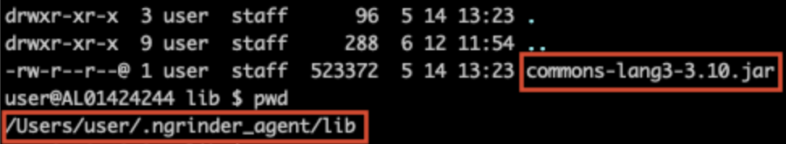
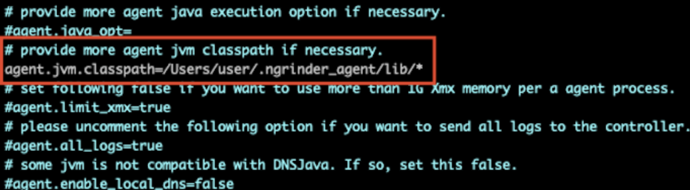
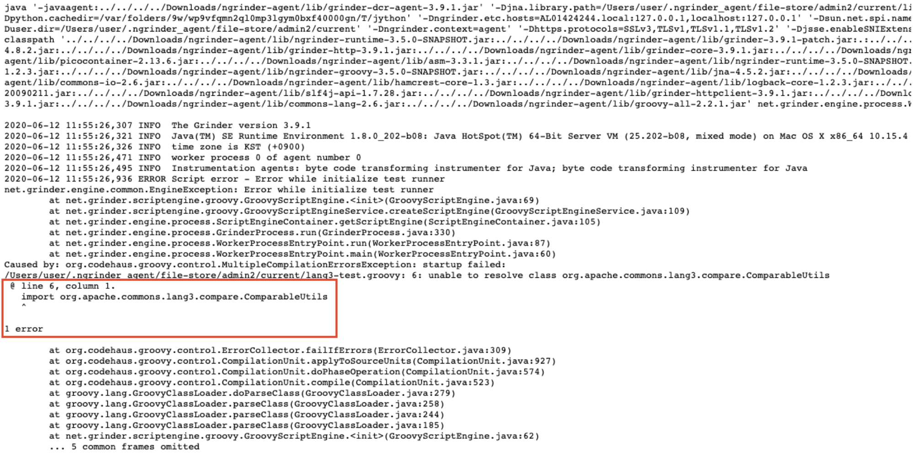
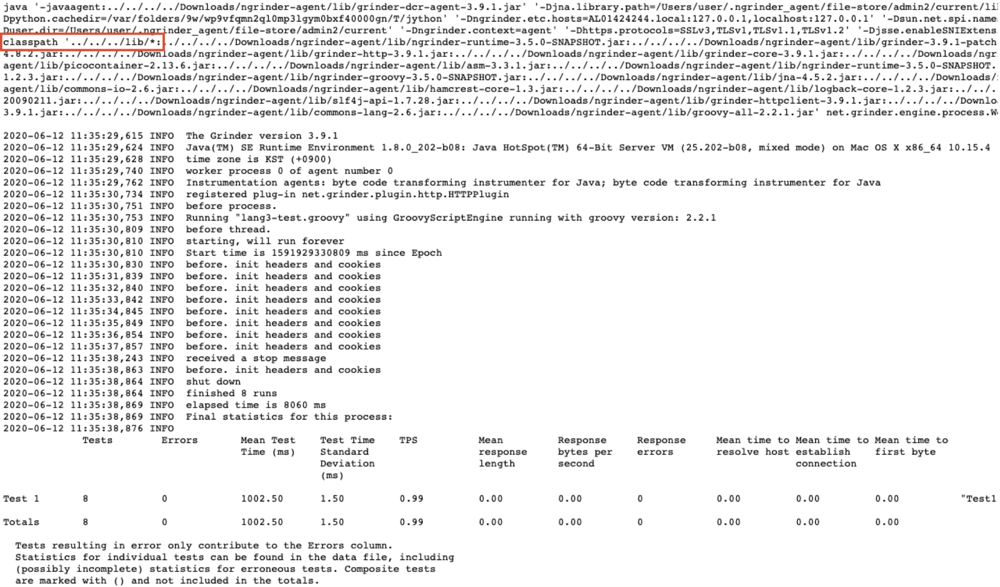

Some tests need external libraries. As larger libraries that the test is importing, time for preparing the performance test goes longer.  
To avoid longer preparation time, you can manually distribute libraries to agent machine and refer to it.  
Until now, you must put them in the `lib` folder that unzipped downloaded agent archive. It was a very limited option. So, we decided to provide another way to add classpath on worker process.

Let's see how to add `common-lang3-3-10.jar` library to the classpath.

1. Place library in any path you want on agent machine.
   
   

2. Open `${NGRINDER_AGENT_HOME}/agent.conf` file and edit `agent.jvm.classpath` option.

   

   ```
   agent.jvm.classpath=${LIBRARY_PATH}
   ```
   Restart the agent for the option to take effect.

3. Refer to imported library.

   - Before setting

      

      Can not find the library in test script.

   - After setting

      


