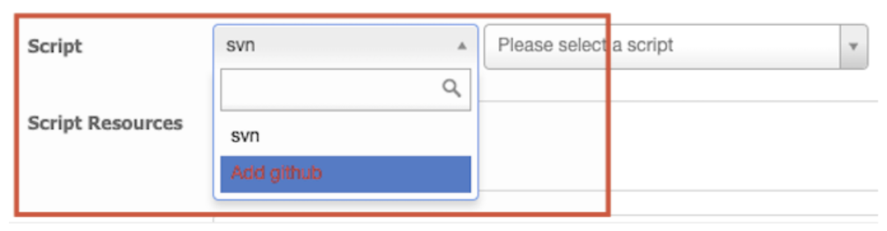
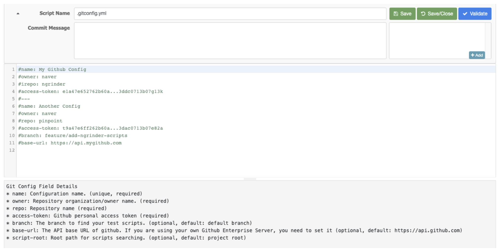
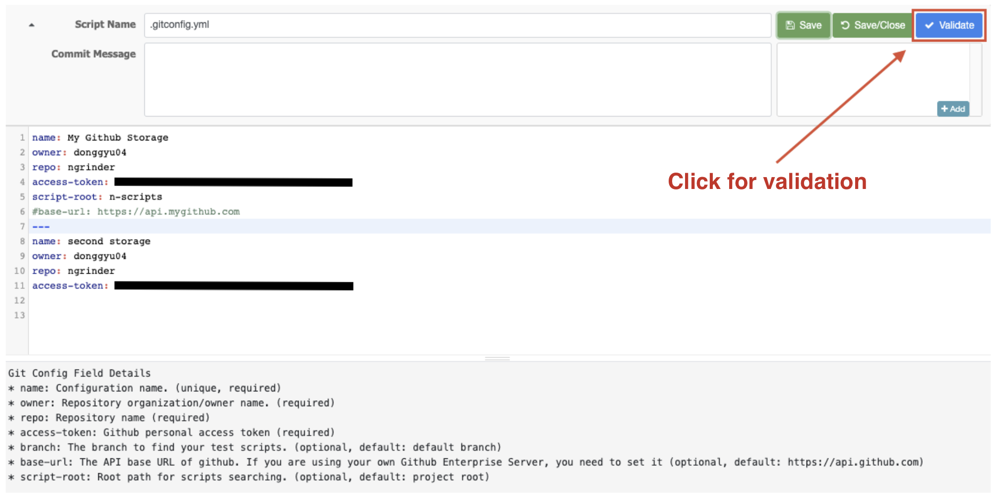
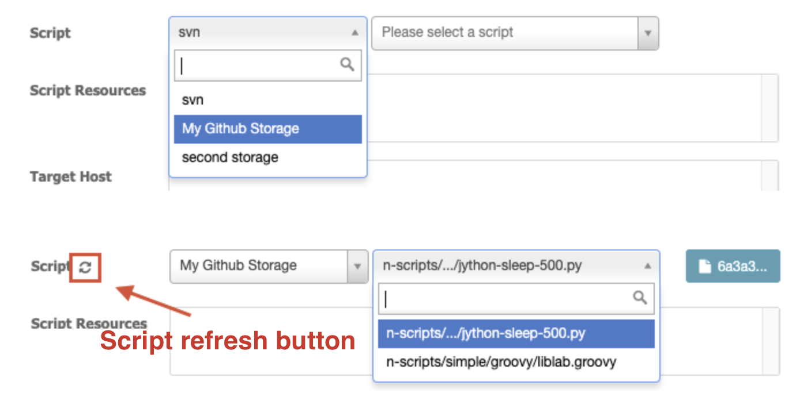
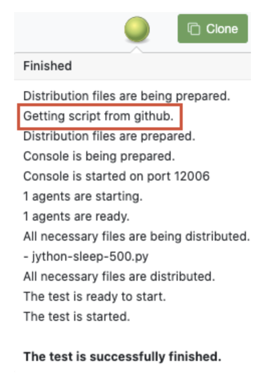
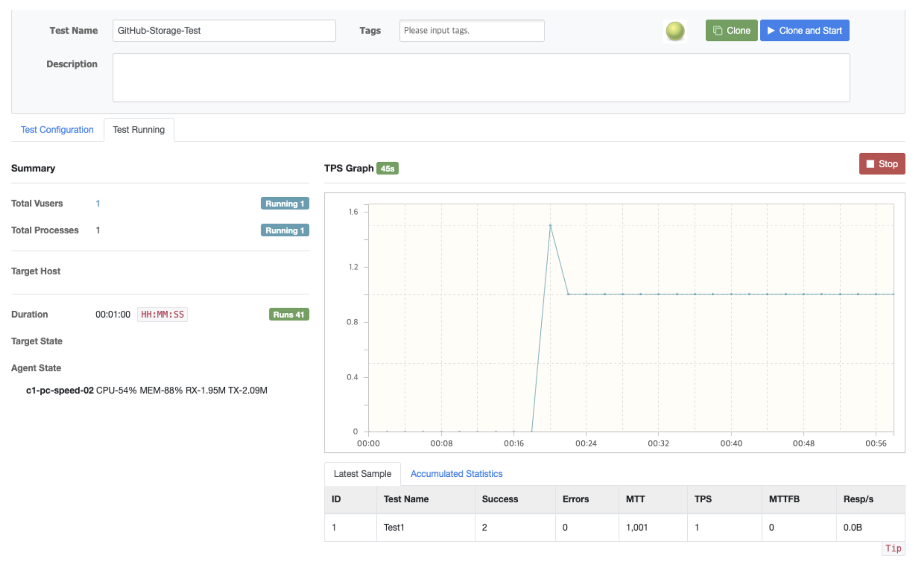

# 1. OverView

nGrinder is a SVN server itself to manage test scripts. SVN is very suitable for nGrinder, but it is an old technology. So, we added github as another script storage.

# 2. Usage

### 1. `.gitconfig.yml`

If you want to use github storage, you must create `.gitconfig.yml`.
This file can be added at the script selection element.



When you select the option `Add GitHub`, the file is automatically created and opened in a new window.



#### Required settings
| Key | Description |
| --- | ----------- |
| name | name of the setting to be displayed in the script selection element.<br>You can add multiple github repository settings. So, it must be a unique value. |
| owner | owner of repository. |
| repo | name of repository. |
| access-token | github personal access token. |

#### Optional settings
| Key | Default | Description |
| ----- | ------- | ----------- |
| branch | repository default branch | base branch for searching test scripts. |
| base-url | `https://api.github.com` | API base URL of github server to accesss.<br>If you are using your own github enterprise server, you need to change this field.<br>You can change default value in the system configuration. |
| script-root | project root | root path where to start searching for the test scripts.<br>The script search is simply based on the file extensions(`.py` and `.groovy`), so you can find all the scripts not related to performance test.<br>Therefore, it is recommended to save nGrinder scripts in specific folder and specify the script-root. |

#### Validation
You can check if your settings are valid with the validate feature.



### 2. Run a test with github storage

Let's a run test with above settings.

#### 1. Select github storage
- Scripts are cached to minimize github API calls and will be loaded when you open the script selection.
- If you update github script before the cache expires, you need to click the refresh script button.



#### 2. Run a test




### 3. Script Structure

#### Normal Script(Jython, Groovy)
- The test scripts can be located anywhere in the repository.
   > It's recommended that scripts be managed in a subfolder rather than project root.
- Resources or libraries have to be located in `resources` or `lib` folder of the same depth with test script.

```
my_test
├── lib
│   └── my_lib.jar
├── my_test.groovy
└── resources
    └── image.png
```

#### Maven Groovy Script
- Maven groovy script structure has the form **`src/main/java/{script}`**, and the pom.xml file must exist at the same depth with **`src`** folder to be recognized as a maven groovy script.
- Put resources in **`resources`** folder of same depth with **`java`** folder.
- Maven groovy project doesn't have **`lib`** folder so, if you want to add some libraries for test you can do it with maven, write that in **pom.xml**.
- If it doesn't satisfy the maven groovy project structure, it will be recognized as a normal script.
```
my_groovy_maven
├── pom.xml
└── src
    └── main
        ├── java
        │   └── TestRunner.groovy
        └── resources
            └── image.png
```

