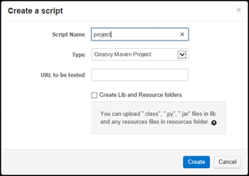
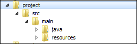

> When you run the groovy maven project, it might take time to run the test at the first time. It's because maven project requires to download the related libraries from maven repo. Please be patient. :-).

If you choose to use Groovy Script when you create a script, it works similar to Jython script except the JUnit styled test cases. However if you want not only to use Groovy but also to execute JUnit runner in your IDE or easily configure dependencies, you can choose to make Groovy Maven Project first.



If you create Groovy Maven Project, you will have the following directories containing three files under the specified project folder.



|Location|Description|
|--------|-----------|
|${name}/pom.xml|Maven project file. You can add the library dependencies in this file.|
|${name}/src/main/java/Test1.groovy|Default groovy script file|
|${name}/src/main/java/resources1.txt|Default resource file|
|${name}/lib|Not automatically generated. but this folder can be used to distribute private libraries if available.|

You can import this project into you IDE using SVN checkout. You may need to check the below links.
- [[Import Groovy Maven Project in IntelliJ]]

In pom.xml, You can specify the additional library dependencies.

```
<project xmlns="http://maven.apache.org/POM/4.0.0" xmlns:xsi="http://www.w3.org/2001/XMLSchema-instance"
    xsi:schemaLocation="http://maven.apache.org/POM/4.0.0 http://maven.apache.org/xsd/maven-4.0.0.xsd">
    <modelVersion>4.0.0</modelVersion>
    <groupId>ngrinder</groupId>
    <artifactId>${name}</artifactId>
    <version>0.0.1</version>

    <properties>
        <jdk-version>1.6</jdk-version>
        <source-encoding>UTF-8</source-encoding>
    </properties>

    <repositories>
        <repository>
            <id>nhnopensource.maver.repo</id>
            <url>https://github.com/nhnopensource/nhnopensource.maven.repo/raw/master/releases</url>
        </repository>
    </repositories>

    <dependencies>
        <!-- Following dependency is mandatory -->
        <dependency>
            <groupId>org.ngrinder</groupId>
            <artifactId>ngrinder-groovy</artifactId>
            <version>3.4</version>
            <scope>provided</scope>
        </dependency>

        <!-- Add the dependencies -->
        <!--  <dependency>
            <groupId>commons-io</groupId>
            <artifactId>commons-io</artifactId>
            <version>2.0.1</version>
        </dependency>
         -->
        <!-- Put your private library like this -->
        <!--
        <dependency>
            <groupId>your_lib</groupId>
            <artifactId>your_lib</artifactId>
            <version>your_lib_version</version>
            <scope>system</scope>
            <systemPath>${project.basedir}/lib/hello.jar</systemPath>
        </dependency>
        -->
    </dependencies>

    <build>
        <plugins>
            <plugin>
                <groupId>org.apache.maven.plugins</groupId>
                <artifactId>maven-compiler-plugin</artifactId>
                <configuration>
                    <source>${jdk-verion}</source>
                    <target>${jdk-version}</target>
                    <encoding>${source-encoding}</encoding>
                </configuration>
            </plugin>

        </plugins>
    </build>
</project>
```

If you like to add the private libraries which do not exist in the public maven repository, you can put them in the lib folder directly and specify the systemPath option like the above sample. lib folder will be automatically detected and copied into agents as well when the controller prepares the script distribution.  
When a script is selected in the performance test configuration page, the controller automatically detects whether the script is under the folder ${name}/src/main/java and there is pom.xml in the base folder. If the controller detects it, the controller will copy the files in the ${name}/src/main/resources and ${name}/src/main/java folder recursively into controller’s distribution preparation folder before distributing them to agents. The below figure illustrates how each folder in svn are copied to the distribution preparation folder.

|folder|path|
|------|----|
|from svn foler|pom.xml|
| |src/main/java/Test1.groovy|
| |src/main/java/package_names/the_other_groovyscripts|
| |src/main/resources/resources1.txt|
| |src/main/resources/subfolder_names/the_other_resources|
| |lib (private libraries)|

|folder|path|
|------|----|
|to dist folder|Test1.groovy|
| |resources1.txt|
| |package_names/the_other_groovy_scripts|
| |subfolder_names/the_other_resources|
| |lib (copied from maven dependencies and files in lib folder existing subversion)|

In generic Jython script and Groovy script, the resources are loaded using command "open(“./resources/resource1.txt”)" or "new File("./resources/resource1.txt"). However this won’t work in Groovy Maven project. We had to replace this path based resource discovery into the classpath based resource discovery to make Groovy JUnit test workable in IDE as well,  
All resources in ${project_name}/src/main/resources/.. are copied into the same folder where the test script is copied but keeping the sub directory hierachy. You can load the resources using code below.

```groovy
import org.codehaus.groovy.reflection.ReflectionUtils;
....


class YourTest {
    String text;

    @BeforeThread
    public void beforeThread() {
       // In groovy, InputStream contains text field.
       text = loadResourceFromClassPath("/resource1.txt").text;
    }

    @Test
    public void doTest() {
       ....
    }

    // This is groovy way to load resource from classpath
    public loadResourceFromClassPath(String resourcePath) {
        return ReflectionUtils.getCallingClass(0).getResourceAsStream(resourcePath);
    }
}
```
