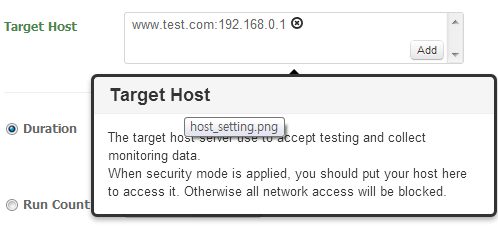
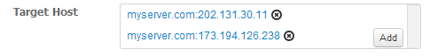

>From nGrinder 3.3, multiple DNS entries to a single host name simulates L4 round-robin behavior.

### Custom DNS
If you need to call the target server with a domain name which is not registered in DNS server, usually this is done by adding the host entry in /etc/hosts. However configuring the tens of agents takes time. So.. nGrinder ships with custom DNS service internally. Instead of touching /etc/hosts, you can configure this on the Target Host field in the nGrinder test configuration. This settings will be automatically distributed when the test is executed. Just put the host name and IP pair in the target host files in the test configuration page. That's it.  


### L4 Simulation by multiple DNS entries
To make system the reliable and scalable , developers frequently use L4 in front of a number of servers so that clients access the L4 VIP (virtual IP) first and L4 distributes them into currently available back-end servers. L4 can be shared by multiple services so that L4 can distribute the requests to the different set of servers depending on where the requests come from.  
However, L4 is the limited resource and has its own capacity. If the count of requests is over than it can handle, they will drop some packet or crash. It can cause the problem when a single L4 is shared by multiple services and run the performance test to one of the services. The load might make the other service's packets lost or L4 itself can be crashed. Which means performance testing on the L4 should be avoid.  
We always recommend to write the script which connects to the servers directly not L4. If multiple servers should be accessed at a single test, this can be done by assign dynamic URL string in the script.
```groovy
@RunWith(GrinderRunner)
class TestRunner {

    public static GTest test
    public static HTTPRequest request
    String[] ips =
        "10.101.10.1",
        "10.101.10.2",
        "10.101.10.3",
        "10.101.10.4"

    @BeforeProcess
    public static void beforeProcess() {
        HTTPPluginControl.getConnectionDefaults().timeout = 6000
        test = new GTest(1, "Test1")
        request = new HTTPRequest()
        test.record(request)
        grinder.logger.info("before process.")
    }


    @BeforeThread
    public void beforeThread() {
        grinder.statistics.delayReports=true
        grinder.logger.info("before thread.")
    }

    @Test
    public void test(){
        Random rand = new Random()
        def ip = ipsrand.nextInt(4)
        grinder.logger.info(ip)
        def result = request.GET("http://$ip/");
        assertThat(result.ststus, is(200))
    }
}
```

However this makes the script complex and not easy to understand. In case of HTTPS, things are worse. It's because each HTTPS call should have the domain name inside so that the HTTP certificate can be verified well. To avoid this, nGrinder 3.3 supports the L4 simulation by DNS rotation by putting same host name to multiple IPs in the target host fields.



Whenever the new DNS resolution is required, the ngrinder underlying DNS engine checks there are multiple IPs mapped to the given DNS name. If there are multiple IPs, it randomly returns one of them.  
```
// myserver.com will be resolved as one of 202.131.30.11 or 173.194.126.238
def result = request.GET("http://myserver.com/hello");
```

```
2014-01-23 16:00:29,737 INFO  http://myserver.com/ -> 200 OK, 83390 bytes
2014-01-23 16:00:29,898 INFO  http://myserver.com/ -> 302 Found, 219 bytes Redirect, ensure the next URL is http://www.google.com/
2014-01-23 16:00:29,898 WARN  Warning. The response may not be correct. The response code was 302.
2014-01-23 16:00:30,157 INFO  http://myserver.com/ -> 200 OK, 83390 bytes
2014-01-23 16:00:30,452 INFO  http://myserver.com/ -> 302 Found, 219 bytes Redirect, ensure the next URL is http://www.google.com/
2014-01-23 16:00:30,452 WARN  Warning. The response may not be correct. The response code was 302.
2014-01-23 16:00:30,745 INFO  http://myserver.com/ -> 302 Found, 219 bytes Redirect, ensure the next URL is http://www.google.com/
2014-01-23 16:00:30,745 WARN  Warning. The response may not be correct. The response code was 302.
```

In above.. you can see some go to 173.194.126.223 (returns 302) and some go to 202.131.30.11 (return 200).

When you use this feature, you should be careful about followings.
- The DNS names in the target host fields are not cached at all. So that we can guarantee to simulate different server access even for multiple calls in a single run. However when DNS names which are not specified at the Target Host fields will be cached internally.  It's because the external DNS server access in performance test can cause the serious problem.
- This DNS rotation doesn't aware of the HTTP session at all. You can not expect L4 sticky session feature here. Even when you access the server using DNS name multiple times in a single run, the different IPs are used to access the server.
