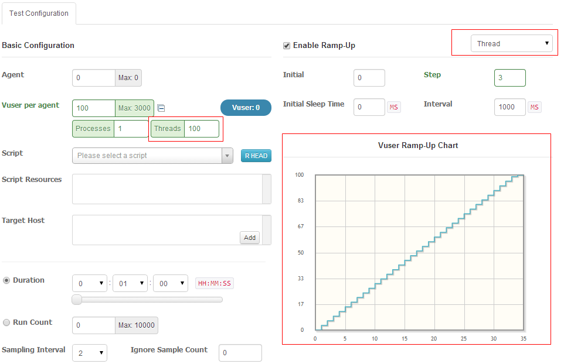

> If you're using previous nGrinder 3.2.X version. See [[Thread ramp up by script]]

### Thread ramp up by perf test configuration
In addition to the process ramp up which the underlying The Grinder engine provides, nGrinder 3.3 supports the thread ramp up. Because the process is the very expensive resource and about 10 is the maximum count of executable process in a single core machine. Because of it, the process ramp-up only supports very limited ramp-up (from 0 to 10) so far. From nGrinder 3.3, the thread ramp up can be enabled by the configuration. Because more than 100 threads can be executed per a process, this made very smooth ramp-up than process ramp-up.



By selecting the Thread in the upper-right and provide the enough thread count in the vuser section, the chart will shows the smooth ramp up chart. After executing the test you may see the result like following in the detailed report. The count of vuser is increased as time goes time and the TPS is increased as well.


### Thread ramp up by script
nGrinder prior to 3.3 version supports the process ramp up as a default feature. If a user want to increase the loads step by steps, User can set a number of process and how to increase them at the ramp-up panel in the test configuration page.


It’s the **process** ramp-up. If you like to 10 steps in ramp-up, you should set the process count at least 10. If you want more, you should set the process count more.  
However, the processes take a lot of resources to be invoked. 100 processes in a agent is not realistic. It will cause the agent machine out of memory error.

Let’s assume that you want to know from which TPS level the system starts to be saturated.  
You can use the thread level ramp up for this case. All you need is to add following code in your script.

### Jython
```python
# -*- coding:utf-8 -*-

# A simple example using the HTTP plugin that shows the retrieval of a
# single page via HTTP.
#
# This script is auto generated by ngrinder.
#

from net.grinder.script.Grinder import grinder
from net.grinder.script import Test
from net.grinder.plugin.http import HTTPRequest
from net.grinder.plugin.http import HTTPPluginControl
from HTTPClient import NVPair

control = HTTPPluginControl.getConnectionDefaults()
control.setTimeout(30000)

test1 = Test(1, "Test1")
request1 = HTTPRequest();
test1.record(request1)

class TestRunner:
  def initialSleep( self ):
      sleepTime = grinder.threadNumber * 1000  # 1 seconds per thread
      grinder.sleep(sleepTime, 0)

  def __call__( self ):
      if grinder.runNumber == 0: self.initialSleep()

      grinder.statistics.delayReports=True
      result = request1.GET("http://www.google.com")

      if result.getText().find("Google") != -1 :
          grinder.statistics.forLastTest.success = 1
      else :
          grinder.statistics.forLastTest.success = 0
```

### Groovy
If you're using nGrinder 3.2.3 or prior, you should put sleep logic in the code.
```groovy
/**
 * A simple example using the HTTP plugin that shows the retrieval of a
 * single page via HTTP.
 *
 * This script is auto generated by ngrinder.
 *
 * @author ${userName}
 */
@RunWith(GrinderRunner)
class Test1 {

    public static GTest test;
    public static HTTPRequest request;

    @BeforeProcess
    public static void beforeClass() {
        test = new GTest(1, "aa000000");
        request = new HTTPRequest();
        test.record(request);
        grinder.logger.info("before process.");
    }


    @BeforeThread
    public void beforeThread() {
        grinder.statistics.delayReports=true;
        grinder.logger.info("before thread.");

    }

    public void initialSleep() {
        grinder.sleep(grinder.threadNumber * 1000, 0)
    }

    @Test
    public void test(){
        if (grinder.runNumber == 0) {
           initialSleep()
                }
        HTTPResponse result = request.GET("http://www.google.com");
        if (result.statusCode == 301 || result.statusCode == 302) {
            grinder.logger.warn("Warning. The response may not be correct. The response code was {}.", result.statusCode);
        } else {
            assertThat(result.statusCode, is(200));
        }
    }
```
