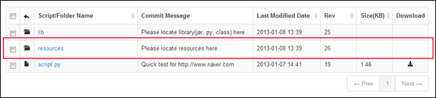

### Jython and generic Groovy
Some users want to use txt or xml files to externalize the resources from scripts. For example, if you have a bunch of user ids and need to test some system with those ids, keeping all ids in the script is not realistic. Instead, you can use resources files which nGrinder supports. Only following file type are distributable
- json, csv, txt, properties

To use resources files, you can create resources folder at the same location with the script.  


The resources folder containing multiple resource files will be passed to the agents during the test execution. In the script you can refer the these resources  like following code.

#### Jython
```python
from net.grinder.script import Test
from net.grinder.script.Grinder import grinder
from net.grinder.plugin.http import HTTPRequest                                                            

test1 = Test(1, "Test1")
test_host = "http://www.sample.com"
request1 = test1.wrap(HTTPRequest(url=test_host))

test_query_file = "./resources/rows_10.txt"


class TestRunner:
    def __init__(self):
        self.urlCount = 0
        self.urlList = []

        try:
            fpQuery = open(test_query_file, "r")
            ....
```

#### Generic Groovy
Generic groovy without maven project structure does exactly same resource action as Jython. You can get the resource using new File("./resources/resource_name"). Please notice that File object in Groovy contains text field for easy file manipulation.
```groovy
@RunWith(GrinderRunner)
class TestRunner {
    static String text
    @BeforeProcess
    public static void beforeProcess() {
                ....
        text = new File("./resources/resource1.txt").text;
    }


    @Test
    public void test(){
        println(text)
        HTTPResponse result = request.GET("http://www.google.com");
        if (result.statusCode == 301 || result.statusCode == 302) {
            grinder.logger.warn("Warning. The response may not be correct. The response code was {}.", result.statusCode);
        } else {
            assertThat(result.statusCode, is(200));
        }
    }
```

#### Groovy Maven Project
However  the above method does not work if you're using Groovy Maven Project.
It's because the resource discovery is changed to classpath based in Groovy Maven Project.
Please refer [[Groovy Maven Structure]] to know how to open resources.
```groovy
import org.codehaus.groovy.reflection.ReflectionUtils;
....


@RunWith(GrinderRunner)
class TestRunner {
    static String text;

    @BeforeProcess
    public static void beforeProcess() {
       // In groovy, InputStream contains text field.
       text = loadResourceFromClassPath("/resource1.txt").text;
    }

    @Test
    public void doTest() {
       ....
    }

    // This is groovy way to load resource from classpath
    public static loadResourceFromClassPath(String resourcePath) {
        return ReflectionUtils.getCallingClass(0).getResourceAsStream(resourcePath);
    }
}
```
