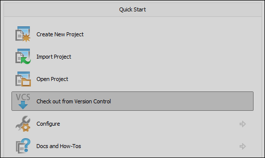

* This document is subject to be changed for ngrinder 3.4

>JetBrain IntelliJ IDEA is the most excellant IDE in the Java world and a lot of open source developers are adopting it in their daily life tools.

IntelliJ is the quite good match to nGrinder Groovy Maven project because it already includes all the plugins(Groovy, SVN, Maven) in its default package and needs very few configurations to run nGrinder test cases. Please follow the below descriptions.

1. Install IntelliJ IDEA Community Edition (It’s free)
    - http://www.jetbrains.com/idea/download/
2. Run IntelliJ IDEA. Enables SVN(Select VCS Integration Plugins page), Maven, Groovy supports(Slect Other Plugins Page).
3. Select “Check out from Version Control”  
   
4. Select the Subversion as VCS and type the SVN url in which SVN maven project is stored. Then type ID / PW.
5. Then check out.
6. In the imported Project, select the “Add Framework Support”  
   
7. Select Groovy and Click OK.  
   
8. Open Maven View.  
   
9. Select the test groovy file and Select “Run Test” on the context menu.  
    
10. Then you will see the following output on the Run panel. Please copy –javaagent… part  
    
11. Click Run=>Edit Configuration Menu.  
    
12. Change the default JUnit VM options to have the javaagent option.  
    
13. Delete JUnit>TestRunner.test configuration.  
    
14. Then run the step 10 again. You will see the following test output view.  
    
15. Debug test cases and commit the code into SVN when you finished.  
    
16. Then run this script in nGrinder!! That’s it!!
