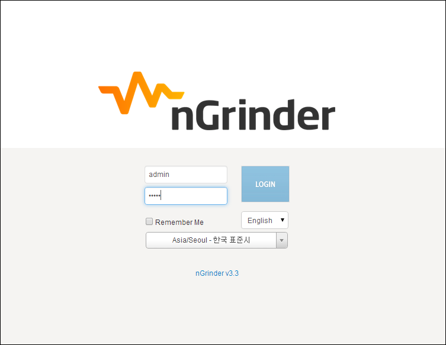

### Prerequisite
- nGrinder is a combination of a web application(Controller) and Java applications(Agent, Monitor). If you don’t know what a controller and agent are, please refer to Architecture.  
  To install nGrinder controller and agent, you need Oracle JDK 1.6~ or OpenJDK 1.7~.
- Please check your PATH environment variable if your java path is located at the head of PATH so that appropriate java can be run.
- nGrinder uses many ports to communicate with agent and agent. If some ports are blocked by your firewall, you should ask the network admin to open the following ports in the firewall. These ports can be configured by the configuration.
    - Agent : Any ==> Controller : 16001
    - Agent : Any ==> Controller : 12000 ~ 12000+(the number of concurrent tests allowed)
    - Controller : Any ==> Monitor : 13243
    - Controller ==> Public user : This is dependent on your tomcat configuration. By default, it is set as 8080.

### Download
You can download nGridner controller from the following link.
- https://github.com/naver/ngrinder/releases

### Install Controller
nGrinder is distributed as a self executable web archive file(WAR) file just like Jenkins, you can put this archive file into your familar web application server (like Tomcat) or run the package in the command line.  
**!Be careful, Never locate the war file in the space containing folder like "C:\Program Files\Tomcat\webapps\".**

### Run on Docker
If you prefer to run in docker. Please see https://hub.docker.com/r/ngrinder/controller/


### Run as a self executable
1. Please make sure that you configured PATH and JAVA_HOME properly in advance.  
   There are a lot of questions by the wrong PATH configuration. You should put java path in the head of PATH env var.  
   For example, in windows it should be set as C:\Program Files\Java\Your java Version\bin;BlarBlar...
2. Run nGrinder controller with the following command.  
   ```
   java -jar ngrinder-controller-X.X.war
   ```
3. Then you will see the following error message. nGrinder requires very big PermGen memory because it includes very many libraries such as  SVNKit, maven, Jetty webserver, groovy, and python. Re-run the ngrinder with the PermGen settings.  nGrinder needs quite big perm-gen memory. Please run nGrinder with the following command.
   ```
   java -XX:MaxPermSize=200m -jar  ngrinder-controller-3.4.war
   ```
4. By default, nGrinder uses 8080 for web server port. If you want to use the other port, please assign --port port_number as a parameter.
   ```
   java -XX:MaxPermSize=200m -jar  ngrinder-controller-3.4.war --port 80
   ```
5. While executing the war file, the war will be extracted into ~/.ngrinder/webapp folder and creates serveral default data files like DBs into .ngrinder folder.
6. If you can see the following logs in the screen, The ngridner controller is now ready to run.
```
INFO 14. 1. 20 오후 4:39:liquibase: ChangeSet ngrinder_datachange_logfile/db.changelog_schema_22.xml::22::ngrinder.3.3 r
an successfully in 4ms

INFO 14. 1. 20 오후 4:39:liquibase: ChangeSet ngrinder_datachange_logfile/db.changelog_schema_23.xml::23::ngrinder.3.3 r
an successfully in 7ms

INFO 14. 1. 20 오후 4:39:liquibase: ChangeSet ngrinder_datachange_logfile/db.changelog_schema_24.xml::24::ngrinder.3.3 r
an successfully in 2ms

INFO 14. 1. 20 오후 4:39:liquibase: ChangeSet ngrinder_datachange_logfile/db.changelog_schema_25.xml::25::ngrinder.3.3 r
an successfully in 7ms

INFO 14. 1. 20 오후 4:39:liquibase: ChangeSet ngrinder_datachange_logfile/db.changelog_schema_26.xml::26::ngrinder.3.3 r
an successfully in 8ms

2014-01-20 16:39:30.633:INFO:/:Initializing Spring FrameworkServlet 'appServlet'

2014-01-20 16:39:31.141:INFO::Started SocketConnector@@0.0.0.0:8080
```
7. Then open the browser and go to http://localhost:8080/

### Run on Tomcat
1. Put the war file in the tomcat’s webapps folder ${TOMCAT_HOME}/webapps . If you want to access the ngrinder without the ngrinder-controller context path, you should change the war file name as ROOT.war.
2. Then open in catalina.sh or catalina.bat and put the following line in the head of the file.
   ```
   JAVA_OPTS="-Xms600m -Xmx1024m -XX:MaxPermSize=200m"    # for catalina.sh
   ```
   ```
   set JAVA_OPTS=-Xms600m -Xmx1024m -XX:MaxPermSize=200m   # for catalina.bat
   ```
3. Then run ${TOMCAT_HOME}/startup.sh or startup.bat
4. Open the browser and go to http://localhost:8080/ngrinder-controller-X.X or http://localhost:8080 if you changed the war file name to ROOT.war

### More
1. nGrinder supports multiple regions(runnging separate sets of agents belong to the multiple network zone) by clustering multiple controllers. See [Controller Clustering Guide]
.
2. There are many configurable options which make nGrinder customized for each needs. See [Controller Configuration Guide].

### Install Agents
Not like previous nGrinder, nGrinder 3.3 agents is downloaded from the controller. The downloaded agent package already contains the default agent configuration connecting to the controller from which the agent is downloaded.
So just unpacking the tar file and running “run_agent.sh” or “run_agent.bat” make the agent connect to the controller.

1. Log in as admin. The default admin password is admin as well.
   

2. Click the top-right menu and click the Download Agent menu.
     

    >Because you’re logged in as admin, the downloadable agent package contains the configurations which let the agents shared by all user.  
If you logged in as not admin account, the link is changed to “Download Private Agent” containning the configurations which let the agents only occupied by the current user.  
See Private Agent for details.

3. The tar archive which contains agent will be downloaded soon.
   - tar file can be extracted using 7zip in Windows or tar xvf tar_file.tar command.
4. Then untar the archive and run run_agent.sh or run_agent.bat. the agent will be executed using following logic.
   1. Check the ~/.ngrinder_agent folder and see the configuration(agent.conf) is there
   2. If it does not exist, copy the current folder’s \_\_agent.conf file into ~/.ngrinder_agent/agent.conf and load it.
   3. If it exists, just run with existing configuration in ~/.ngrinder_agent/agent.conf.
5. If you like to overwrite the existing configuration with latest configuration, please put ‘-o‘ option as a parameter  
   ```
   run_agent.sh -o # for linux / mac

   run_agent_bg.sh -o # If you want to run it in the background for linux / mac
   ```
   or
   ```
   run_agent.bat –o # for windows
   ```
6. If you want to stop the agent.  
   ```
   stop_agent.sh # for linux / mac
   ```

   or
   ```
   stop_agent.bat # for windows
   ```
7. From nGrinder 3.3, the connected agent is automatically approved by controller. However if you provided  
   ```
   controller.enable_agent_auto_approval=true
   ```

   configuration in the controller configuration, You have to approve agents by yourself.
8. To approve agents, go to Agent Management menu and click the approve button.
   
9. If you run an agent in Linux, you may need to configure ulimit to run many threads. please check followings.
```
> ulimit -a

core file size          (blocks, -c) 0

data seg size           (kbytes, -d) unlimited

scheduling priority             (-e) 0

file size               (blocks, -f) unlimited

pending signals                 (-i) 30676

max locked memory       (kbytes, -l) 64

max memory size         (kbytes, -m) unlimited


open files                      (-n) 16000

pipe size            (512 bytes, -p) 8

POSIX message queues     (bytes, -q) 819200

real-time priority              (-r) 0

stack size              (kbytes, -s) 10240

cpu time               (seconds, -t) unlimited

max user processes              (-u) 32768

virtual memory          (kbytes, -v) unlimited

file locks                      (-x) unlimited
```
   If your machine has small "max user processes" and "open files" entry when you run "ulimit -a", please make it at least over 10000. Open /etc/security/limits.conf file in the root account and add followings.
```
your_account soft    nproc           32768

your_account hard    nproc           32768

root         soft    nproc           32768

root         hard    nproc           32768

your_account soft    nofile          16000

your_account hard    nofile          16000

root         soft    nofile          16000

root         hard    nofile          16000
```
>By default, the only one agent per machine is supported. However if you want to run multiple agents in a single machine, you have to configure some agent option. Please refer [[Agent Configuration Guide]].

### Install Monitor
nGrinder Monitor is the subset of the agent package and is installed into target machine to collect system statistics(such as CPU, MEM and Network) under the loads.  
You can download monitors from the controller as well.

1. Download the monitor.  

2. Then untar the monitor package and run the batch or shell files.
   ```
   run_monitor_bg.sh  # for linux / mac
   ```

   or
   ```
   run_monitor.bat # for windows
   ```

3. If you want to stop the monitor, run following commands.  
   ```
   stop_monitor.sh # for linux / mac
   ```

   or
   ```
   stop_monitor.bat –o # for windows
   ```

OK. Now you're ready to run the first performance test. Go to [[Quick Start]]