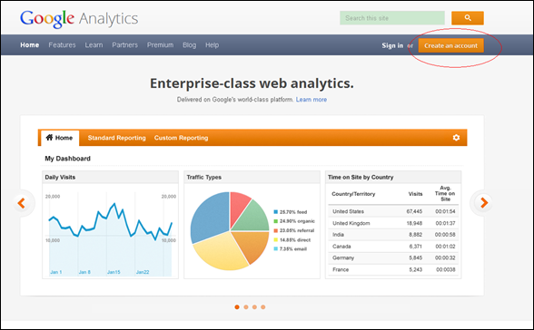
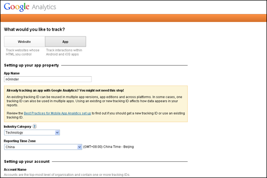
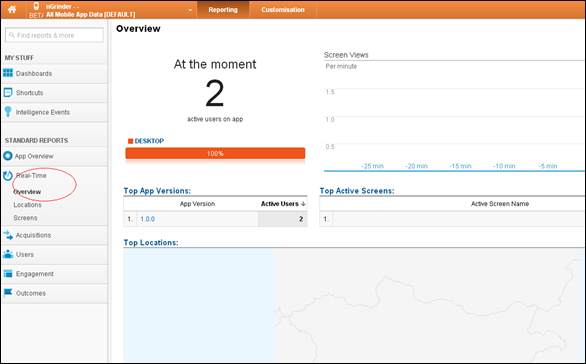
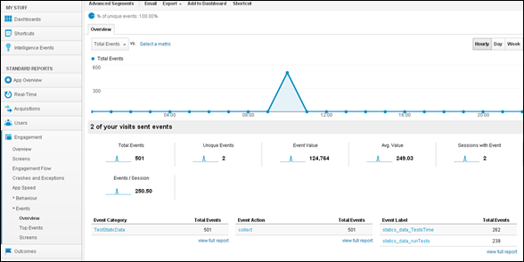

**This post will introduces Java Implementation for Measurement Protocol**

The Measurement Protocol is part of Universal Analytics(UA),which allows developers to make HTTP requests to send raw user interaction data directly to Google Analytics servers.

First,you must have an account in Google Analytics.



Please selecting App to track when you sign in.



After above setting,we have gotten a Tracking ID (UA-XXXXXXX-X).

Now we will use Measurement Protocol java API to collect data and send to UA.
```java
GoogleAnalytic analytic = new GoogleAnalytic("nGrinder","1.1.0","UA-XXXXXX-X");
analytic.sendStaticDataToUA("statics_data_runTests", dataValue);
analytic.sendStaticDataToUA("statics_data_runTests", dataValue);
```

Because of "Time Delay" Problems,you'd better to wait some times and then observe statistic data later in Google Analytic.

From Real-Time, active users number is being displayed.



This is all collect data.


