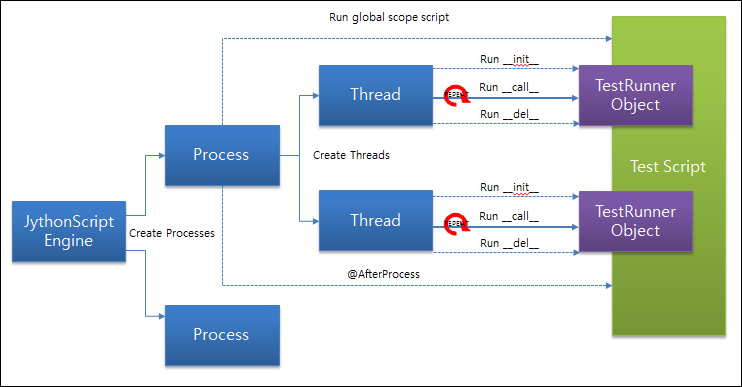
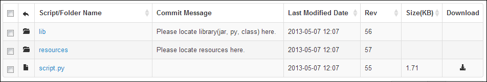

nGrinder uses The Grinder Jython Script with no modification. Following is the Jython template nGrinder uses.

```python
# -*- coding:utf-8 -*-

# A simple example using the HTTP plugin that shows the retrieval of a
# single page via HTTP.
#
# This script is auto generated by ngrinder.
#
# @author user name
from net.grinder.script.Grinder import grinder
from net.grinder.script import Test
from net.grinder.plugin.http import HTTPRequest
from net.grinder.plugin.http import HTTPPluginControl


control = HTTPPluginControl.getConnectionDefaults()
# if you don't want that HTTPRequest follows the redirection, please modify the following option 0.
# control.followRedirects = 1
# if you want to increase the timeout, please modify the following option.
control.timeout = 6000

test1 = Test(1, "test name here")
request1 = HTTPRequest()

# Make any method call on request1 increase TPS
test1.record(request1)

class TestRunner:
    # initlialize a thread
    def __init__(self):
        grinder.statistics.delayReports=True
        pass

    # test method       
    def __call__(self):
        result = request1.GET("http://url to be tested”)

        # You get the message body using the getText() method.
        # if result.getText().find("HELLO WORLD") != -1 :
        #    grinder.statistics.forLastTest.success = 1
        # else :
        #     grinder.statistics.forLastTest.success = 0

        # if you want to print out log..
        # Don't use print keyword.
        # instead use following.
        # grinder.logger.info("Hello World")


        if result.getStatusCode() == 200 :
            grinder.statistics.forLastTest.success = 1
        elif result.getStatusCode() in (301, 302) :
            grinder.logger.warn("Warning. The response may not be correct. The response code was %d." %  result.getStatusCode())
            grinder.statistics.forLastTest.success = 1
        else :
            grinder.statistics.forLastTest.success = 0
```

The each process in the Grinder jython scriptengine reads the whole script and each thread executes the TestRunner’s \_\_call\_\_ method.  
This execution can be illustrated by the following figure.



When JythonScript engine creates processes, each process run the global scope script first. In above template, the following is the gloabl scope script which is executed once per process.

```
control = HTTPPluginControl.getConnectionDefaults()
# if you don't want that HTTPRequest follows the redirection, please modify the following option 0.
# control.followRedirects = 1
# if you want to increase the timeout, please modify the following option.
control.timeout = 6000

test1 = Test(1, "mytest”)
request1 = HTTPRequest()

# Make any method call on request1 increase TPS
test1.record(request1)
```

In the above part, the test statistics are prepared and request1 object is instrumented to record any methods call on request1 object.  
Then the multiple threads are created and each thread creates a TestRunner object by running the \_\_init\_\_ method.  
\_\_init\_\_ method is subject to be invoked once per thread. Therefore, this method is the perfect place to login if your target system needs the login.

```
class TestRunner:
    # initlialize a thread
    def __init__(self):
        grinder.statistics.delayReports=True
        pass
```

After creating TestRunner object, each thread continuously invokes \_\_call\_\_() method on the created TestRunner object until the test is finished.

```
# test method       
def __call__(self):
    result = request1.GET(<a href="http://www.google.com">http://www.google.com</a>)

    # You get the message body using the getText() method.
    # if result.getText().find("HELLO WORLD") != -1 :
    #    grinder.statistics.forLastTest.success = 1
    # else :
    #     grinder.statistics.forLastTest.success = 0

    # if you want to print out log..
    # Don't use print keyword.
    # instead use following.
    # grinder.logger.info("Hello World")


    if result.getStatusCode() == 200 :
        grinder.statistics.forLastTest.success = 1
    elif result.getStatusCode() in (301, 302) :
        grinder.logger.warn("Warning. The response may not be correct. The response code was %d." %  result.getStatusCode())
        grinder.statistics.forLastTest.success = 1
    else :
        grinder.statistics.forLastTest.success = 0
```

When the agent gets the stop message from controller or specified run count is reached, each thread is terminated. Before thread terminations, thread invokes \_\_del\_\_(self) method to clean up the test. If you don’t provide this method in the test script, it’s just ignored.  
When starting a test in the controller, not only script but also following folders which exists at the same folder as the script is located are transfered to the agents.



All transfered library files like .class, .py, .jar located in the lib folder are automatically are set a library path.  Therefore you can extend the test script to use 3rd party library. In addition, you can locate any resources in the resources folder. The resources can be opened by calling

```
open("./resources/resource_file_name.txt")
```

Please check out [[How to use library]] and [[How to use resources]] for detailed instruction.

However, from nGrinder 3.2, we start to support Groovy as a scripting language. We believe this is much powerful way. Check out [[Groovy Script Structure]] as well for the detailed instruction.
