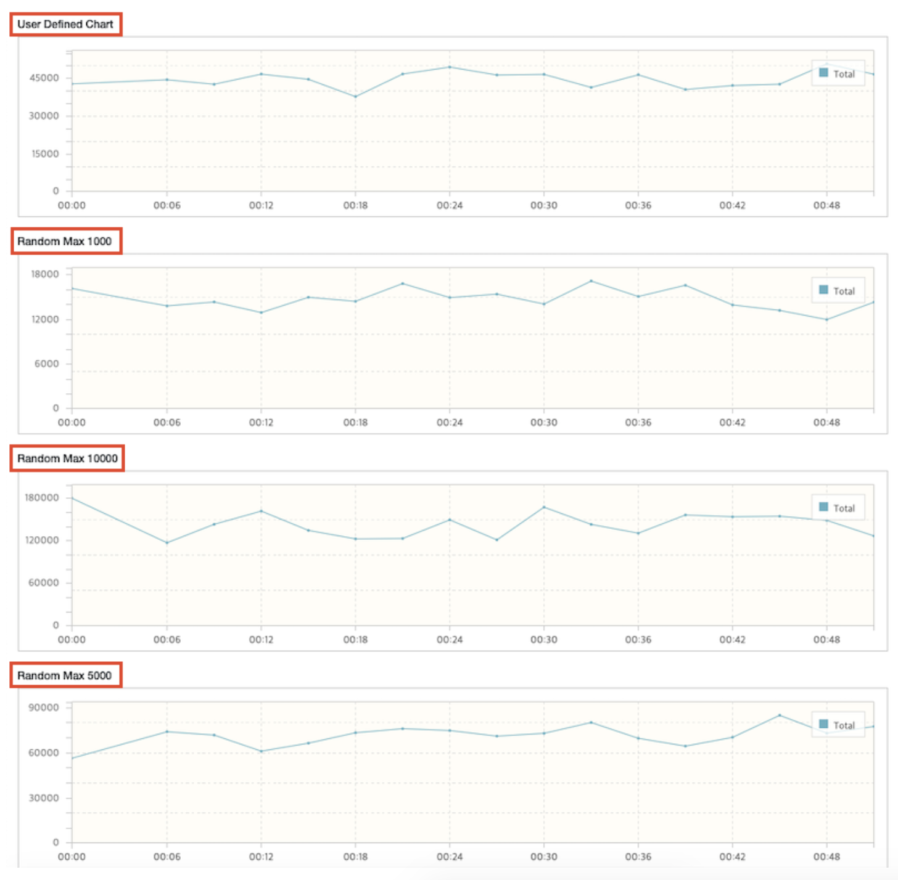

Maybe you know that "The Grinder" supports user defined statistic. If you define and put some value in the script, then this filed can be saved in data log or summary data. You can check the example script for this from:

http://grinder.sourceforge.net/g3/script-gallery.html#jmsreceiver.py

But in ngrinder, in previous 3.1.2 version, you can not see that data in test report. But from version 3.1.2, you can see that data in report chart.

The sample script is below:

##### JYTHON
```python
# -*- coding:utf-8 -*-

# A simple example using the HTTP plugin that shows the retrieval of a
# single page via HTTP.
#
# This script is auto generated by ngrinder.
#
# @author admin
from net.grinder.script.Grinder import grinder
from net.grinder.script import Test
from net.grinder.plugin.http import HTTPRequest
from net.grinder.plugin.http import HTTPPluginControl
from java.util import Random

control = HTTPPluginControl.getConnectionDefaults()
# if you don't want that HTTPRequest follows the redirection, please modify the following option 0.
# control.followRedirects = 1
# if you want to increase the timeout, please modify the following option.
control.timeout = 6000

test1 = Test(1, "Test1")
request1 = HTTPRequest()

#grinder.statistics.registerDataLogExpression("Delivery time", "userLong0")
grinder.statistics.registerSummaryExpression("User_defined", "(/ userLong0(+ (count timedTests)))")

# Make any method call on request1 increase TPS
test1.record(request1)
random = Random()

class TestRunner:
    # initlialize a thread
    def __init__(self):
        grinder.statistics.delayReports=True
        pass

    # test method      
    def __call__(self):
        result = request1.GET("http://www.naver.com")

        # do something
        deliveryTime = random.nextInt(1000)
        grinder.sleep(deliveryTime)
        grinder.logger.info("deliveryTime: %d" % deliveryTime)
        grinder.statistics.forLastTest.setLong("userLong0", deliveryTime)

        if result.getStatusCode() == 200 :
            grinder.statistics.forLastTest.success = 1
        elif result.getStatusCode() in (301, 302) :
            grinder.logger.warn("Warning. The response may not be correct. The response code was %d." %  result.getStatusCode())
            grinder.statistics.forLastTest.success = 1
        else :
            grinder.statistics.forLastTest.success = 0
```

##### Groovy
```groovy
@RunWith(GrinderRunner)
class Test1 {

    public static GTest test;
    public static HTTPRequest request;

    @BeforeProcess
    public static void beforeClass() {
        test = new GTest(1, "aa000000");
        // Register a custom statistics
        grinder.statistics.registerSummaryExpression("User_defined", "(/ userLong0(+ (count timedTests)))")
        request = new HTTPRequest();
        test.record(request);
        grinder.logger.info("before process.");
    }

    Random random = new Random();

    @BeforeThread
    public void beforeThread() {
        grinder.statistics.delayReports=true;
        grinder.logger.info("before thread.");
    }


    @Test
    public void test(){
        HTTPResponse result = request.GET("http://www.google.com");
        def deliveryTime = random.nextInt(1000)
        grinder.sleep(deliveryTime)
        grinder.logger.info("deliveryTime: ${deliveryTime}")
        // Update statistics
        grinder.statistics.forLastTest.setLong("userLong0", deliveryTime)

        if (result.statusCode == 301 || result.statusCode == 302) {
            grinder.logger.warn("Warning. The response may not be correct. The response code was {}.", result.statusCode);
        } else {
            assertThat(result.statusCode, is(200));
        }
    }
```

For more detailed description of usage, you can refer the document of grinder:   [Register Summary Expression](http://grinder.sourceforge.net/g3/script-javadoc/net/grinder/script/Statistics.html#registerSummaryExpression%28java.lang.String%2C%20java.lang.String%29). After running a test with this script, you can see the chart for user defined statistics in the detailed report.  


### Multiple User Defined Statistics

So far, only one chart can be displayed for the user defined statistic.  
Since nGrinder 3.5.0, we provide multiple user defined statistics.

```groovy
@RunWith(GrinderRunner)
class TestRunner {

    public static GTest test
    public static Random random

    @BeforeProcess
    public static void beforeProcess() {
        test = new GTest(1, "Test1")
        random = new Random()

        grinder.statistics.registerSummaryExpression("User_defined", "(+ userLong0(+ (count timedTests)))")
        grinder.statistics.registerSummaryExpression("User_defined_Random_Max_1000", "(+ userLong1(+ (count timedTests)))")
        grinder.statistics.registerSummaryExpression("User_defined_Random_Max_5000", "(+ userLong2(+ (count timedTests)))")
        grinder.statistics.registerSummaryExpression("User_defined_Random_Max_10000", "(+ userLong3(+ (count timedTests)))")
    }

    @BeforeThread 
    public void beforeThread() {
        test.record(this, "test")
        grinder.statistics.delayReports=true;
    }

    @Test
    public void test(){
        sleep(100);
        grinder.statistics.forCurrentTest.setLong("userLong0", random.nextInt(3000));
        grinder.statistics.forCurrentTest.setLong("userLong1", random.nextInt(1000));
        grinder.statistics.forCurrentTest.setLong("userLong2", random.nextInt(5000));
        grinder.statistics.forCurrentTest.setLong("userLong3", random.nextInt(10000));
    }

}
```

you can see the chart for user defined statistics in the detailed report.



> Result ​​may differ depending on the expression and test settings. See [the grinder statistic document](http://grinder.sourceforge.net/g3/script-javadoc/net/grinder/script/Statistics.html) for more detail.
