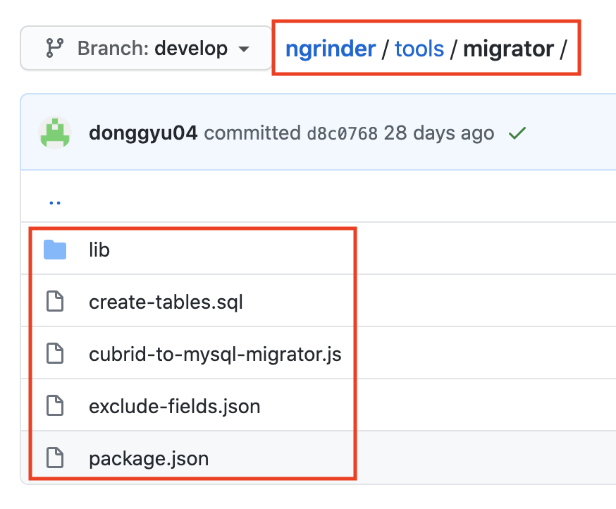
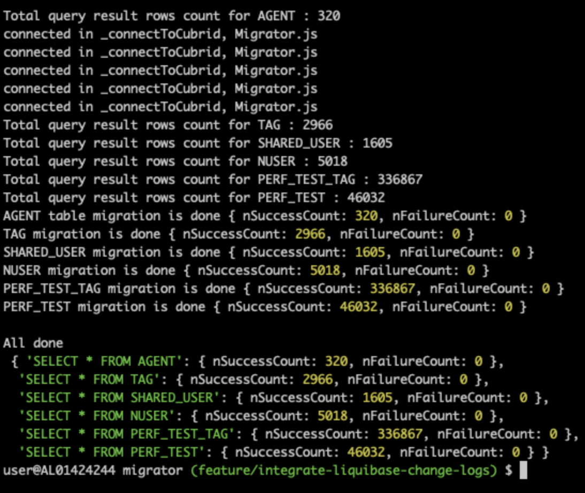

Since nGrinder 3.5.0, we decided to fade out Cubrid. Now, nGrinder supports MySQL and provides the script to migrate database from Cubrid to MySQL.

1. Clone ngrinder repository and move to migrator directory

   

   ```
    git clone https://github.com/naver/ngrinder
    cd ngrinder/tools/migrator
    ```

2. Edit database configuration in `cubrid-to-mysql-migrator.js`.
    ```
    var htCubrid = {
        sHostname: 'sepecify_cubrid_ip',
        sUser: '',
        sPassword: '',
        nPort: 33000,
        sDatabase: 'ngrinder'
    }

    var htMysql = {
        sHostname: 'sepecify_mysql_ip',
        sUser: '',
        sPassword: '',
        nPort: 3306,
        sDatabase: 'ngrinder',
        bDebug: false
    }
    ```
3. Install the required node modules.
    ```
    npm install
    ```
4. Run the migration script.
    ```
    node --max-old-space-size=5120 cubrid-to-mysql-migrator.js
    ```
   > Before running the script, you must create the database `ngrinder` manually in your MySQL database.

5. Migration will be done in a few minutes.

   