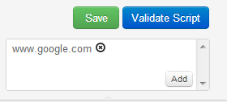

nGrinder executes user- defined scripts. Scripts can access the local file system and send any network requests to non predefined targets. For this reason, it’s very dangerous to allow unknown public users to have access to nGrinder. Some hacker may write a script that sends multicast messages  or deletes all files in the nGrinder running account home. In addition, some user might write a DDOS attack script on another site.

To protect these, nGrinder 3.0 has introduced Security Mode. If you set security=true in ${NGRINDER_HOME}/system.conf, all scripts are executed under the context of NGrinderSecurityManager. NGrinderSecurityManager is the extension of Java’s SecurityManager technology. In security mode, all script is executed under the control of NGrinderSercurityManager. NGrinderSecurityManager does the following.

- Access to targets not specified in target host files is completely prohibited.
- Access with multicast messages is completely prohibited.
- Access to file system outside of current folder(“.”) is not allowed.
- Access to system clipboard is not allowed.

If securityMode is on, the user should consider where he or she is writing the scripts to. The easiest way to make scripts valid is to use the script validation feature in the script editor. When users validate scripts in the script editor, they can see which parts of a script are blocked by nGrinder.

For example:..a user may have a script that attemps to tries access the nGrinder running account home path, as shown below.  
```python
class TestRunner:
    def __call__(self):
        open("../../hello", "w")
```

Then the user will see the following message during validation.  
```
File "C:\Users\junoyoon\.ngrinder\script\admin\ewewe.py", line 18, in __call__
java.lang.SecurityException: Write access on ....hello(C:\Users\junoyoon\.ngrinder\hello) is not allowed.
```

In addition, the user might want to launch a DDOS attack on Google as shown below.  
```python
class TestRunner:
    def __call__(self):
        result = request1.GET("http://www.google.com")
```

If the user didn't provide www.google.com in the target host fields, the user might see the following message during validation.   
```
net.grinder.scriptengine.jython.JythonScriptExecutionException: Java exception calling TestRunner
    File "C:\Users\junoyoon\.ngrinder\scriptadmin\ewewe.py", line 18, in __call__
java.lang.SecurityException: NetWork access on www.google.com is not allowed. Please add www.google.com on the target host setting.
```

In such a case, the user can access the target by specifying www.google.com in the target host field. This may seem strange, as it does not actually block illegal access to www.google.com simply by specifying the host.



Actual network access blocking is the responsibility of the PlugIn. The plugin checks whether the target hosts are allowed access or not. Our security system just guarantees the target hosts field value is well provided.

For plugin development, please refer [[How to develop Plugin]]
