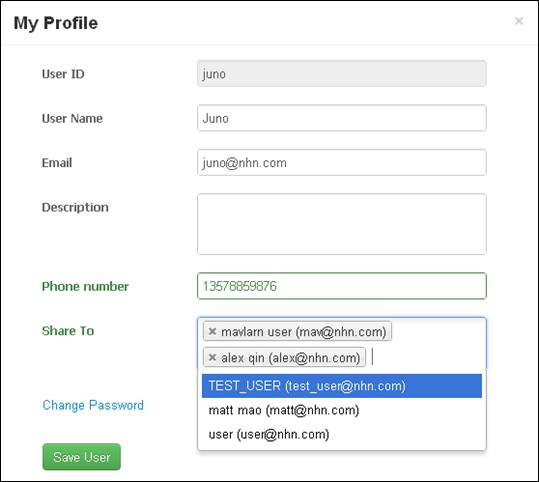
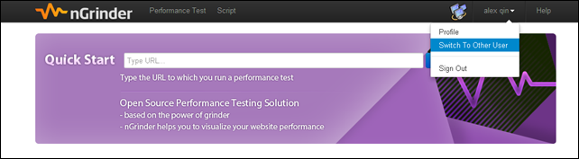
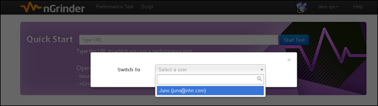
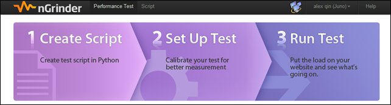

> - This feature is available from 3.1

Users can share their account with others by User Account Share feature.  
If a user share his permissions to others, the other users can switch to his account anytime the others want. This feature is extremely useful when the developers in a team should work on the same script.  

If you want to share own permissions to other user,  press **Profile** and select whom you want to share your account.  In above case, Juno make his account shared by Mavlarn and Alex.  

When Mavlarn and Alex login, they can see Juno in the Switch To Other User menu.  

**Note:**
> Admins can switch other users by default.  
Admins / Users can not switch to admins.
