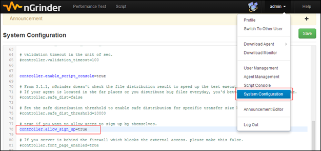
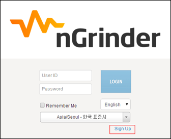
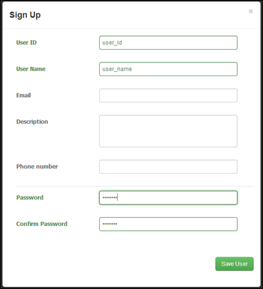

> This tutorial describes how to enable the user sign up which is introduced from nGrinder 3.3.

nGrinder is the web application. In our company(Naver), more than 1000 users has been registered in the single nGrinder instance and we’ve developed SSO plugin to avoid the user management overhead. So any users here can access nGrinder without any user registration step. However, if there are less than 100 possible users and the controller is located in the intranet, developing such a plugin might be the overhead. However it still makes the administration overhead. The admin should create the new user whenever some guy wants to use nGrinder. Therefore nGrinder 3.3 introduced “User Sign Up” feature for users to register themselves into nGrinder. By default, this feature is disabled because nGrinder is risky due to heavy loads on the network and there are possiblity which careless users can make mistakes. When enabling the “User Sign Up” feature, the admin should be aware of the consequent effect.

### Enabling Sign Up
1. Log in as admin and go to “System Configuration”
2. Put the following option in the configuration editor.  

   ```
controller.allow_sign_up=true
```

   
   If you want to get the user email and mobile phone number when new users sign up. Please put the following as well.  

   ```
controller.user_security=true
```
   If it’s false, the users can register themselves without the email and mobile phone number.
3. Log out and check if there is “Sign Up” link in the login page.  
   

### Sign Up
1. If the admin enabled the sign up, The user can register him/herself by clicking the sign up button in the login page.
2. After clicking this button, fill up the user sign up form.  
   
3. After clicking the “Save User” button, the user can login with the created user account.
