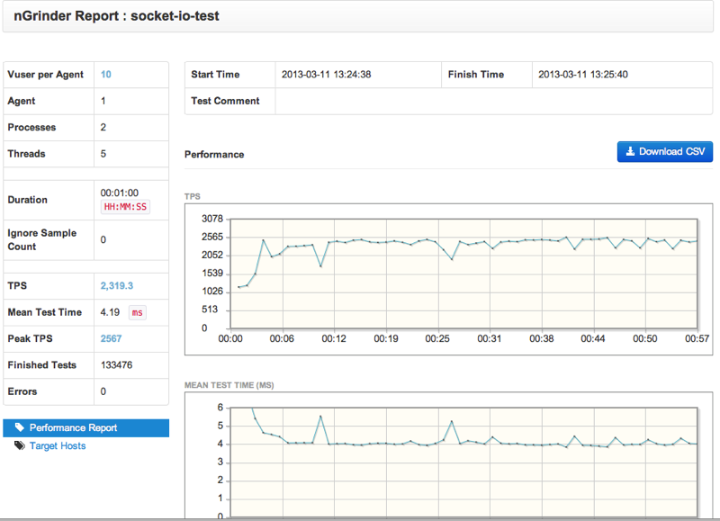

nGrinder can not only be used to test the normal web application, but also can be used for JDBC, web service and realtime apps like socket.io provides.

Socket.io aims to make realtime apps possible in every browser and mobile device. With the extensibility of nGrinder, we can test a socket.io based app with the help of extended library. We can use this socket.io-java-client library to do it.

But this library use an async way to send request and receive response. So we need some modification based on the SocketIO class to do it in a synchronized way.

If you are not familiar with the  socket.io-java-client , please go to get the code and check the example in it.

The main idea is, using the SocketIO object to create a connection to the app server, and provide a function to send request to server, and get the response and return. And in this example, I use Java Lock and Condition to archive this.

And below is the source of BlockingSocketIO class:
```java
package my;

import io.socket.IOAcknowledge;
import io.socket.IOCallback;
import io.socket.SocketIO;
import io.socket.SocketIOException;

import java.util.concurrent.locks.Condition;
import java.util.concurrent.locks.ReentrantLock;

import org.json.JSONObject;

/**
 * Class description.
 *
 * @author Mavlarn
 * @since
 */
public class BlockingSocketIO implements IOCallback {

    private SocketIO socketIO;
    private ReentrantLock transportLock;
    private Condition responseCondition;
    private String respMsg;

    public BlockingSocketIO (String url) {
        try {
            transportLock = new ReentrantLock();
            responseCondition = transportLock.newCondition();
            socketIO = new SocketIO(url, this);
        } catch (Exception e) {
            e.printStackTrace();
        }
    }

    public String sendAndRcv (final String message) {
        try {
            transportLock.lock();
            socketIO.send(message);
            respMsg = null;
            responseCondition.await();
            return respMsg;
        } catch (Exception e) {
            e.printStackTrace();
        } finally {
            transportLock.unlock();
        }
        return respMsg;
    }

    public String sendAndRcv(final JSONObject json) {
        try {
            transportLock.lock();
            socketIO.send(json);
            respMsg = null;
            responseCondition.await();
            return respMsg;
        } catch (Exception e) {
            e.printStackTrace();
        } finally {
            transportLock.unlock();
        }
        return respMsg;
    }

    public String emitAndRcv(String event, final Object args) {
        try {
            transportLock.lock();
            socketIO.emit(event, args);
            respMsg = null;
            responseCondition.await();
            return respMsg;
        } catch (Exception e) {
            e.printStackTrace();
        } finally {
            transportLock.unlock();
        }
        return respMsg;
    }

    @Override
    public void onMessage(JSONObject json, IOAcknowledge ack) {
        setResponse(json.toString());
    }

    @Override
    public void onMessage(String data, IOAcknowledge ack) {
        setResponse(data);
    }

    private void setResponse(String data) {
        try {
            transportLock.lock();
            respMsg = data;
            responseCondition.signal();
            System.out.println("Server said:" + data);
        } finally {
            transportLock.unlock();
        }
    }

    @Override
    public void onError(SocketIOException socketIOException) {
        System.out.println("an Error occured");
        socketIOException.printStackTrace();
    }

    @Override
    public void onDisconnect() {
        System.out.println("Connection terminated.");
    }

    @Override
    public void onConnect() {
        System.out.println("Connection established");
    }

    @Override
    public void on(String event, IOAcknowledge ack, Object... args) {
        System.out.println("Server triggered event '" + event + "'");
        setResponse(args<a href="/wiki_ngrinder/entry/0" class="notexist">[0</a>.toString());
    }

}
```

In this class, I use [socket.io-java-client](https://github.com/Gottox/socket.io-java-client) library to send message to socket.io server, and get response with the help of Lock and Condition. And we need to package this class in jar and upload it into lib folder in nGrinder. You should also upload socketio.jar and its dependency libs WebSocket.jar and json-org.jar. And next, we need  the python script for test in nGrinder.  It will be as below:
```groovy
from net.grinder.script.Grinder import grinder
from net.grinder.script import Test

from org.json import JSONObject
from my import BlockingSocketIO

test1 = Test(1, "Test1")

class TestRunner:

    def testSocketIO(self):
        json = JSONObject()
        user = "Thread-%s" % grinder.threadNumber
        json.putOpt("user", user)
        msg = "test message<%s>." % user
        json.putOpt("message", msg)
        grinder.logger.info("msg:" + json.toString())
        respMsg = self.socketIO.emitAndRcv("user message", json)
        return respMsg

    def __init__(self):
        grinder.statistics.delayReports=True
        #init socket io
        #create socket io object in thread init function. Then every thread will use its own socket.io connection.
        self.socketIO = BlockingSocketIO("http://127.0.0.1:3000")

        #send socket.io server to init user
        json = JSONObject()
        user = "Thread-%s" % grinder.threadNumber
        json.putOpt("username", user)
        self.socketIO.emitAndRcv("user", json)

    # test method       
    def __call__(self):
        resp = self.testSocketIO()

        if "test message" in resp :
            grinder.statistics.forLastTest.success = 1
        else :
            grinder.statistics.forLastTest.success = 0

test1.record(TestRunner.testSocketIO)
```

In this script, in the init function of test runner, we created a socket.op connection object, then all the tests of this thread will use the same connection. It is very important for the long pooling app based on socket.io. And in thie init function, a message with “user” event in sent to server to init the user in server side. And in every test function, we will send a message with “user message” event. Before we can test this script, we need a server side app. We need node.js installed with the module “socket.io”.

And write a script as below, which is named server.js:
```groovy
var http = require('http'), io = require('socket.io');

var app = http.createServer();
app.listen(3000);

console.log('Server running at http://127.0.0.1:3000/');

// Socket.IO server
var io = io.listen(app);

io.sockets.on('connection', function (socket) {
  console.log("new connection from" + socket); get and log connection
  socket.on('user message', function (msg) {  //accept a request with “user message” event
    socket.emit('user message processed', {user: msg.user, message: msg.message});
  });

  socket.on('user', function (userMsg) { //accept a request with “user” event, like user login.
    socket.user = userMsg.username;
    socket.emit('user processed', {user: userMsg.user, message: "New user come in."});
  });

  socket.on('disconnect', function () {
    if (!socket.user) return;
    socket.emit('announcement', {user: socket.user, action: 'disconected'});
  });
});
```

And run this simulated server with :
```
node server.js
```

You should see a log said the server is running at http://127.0.0.1:3000/.
Then, validate this script to make sure it can work properly. The validation result should be as below:
```
2013-03-11 13:13:08,844 INFO  elapsed time is 17 ms
2013-03-11 13:13:08,844 INFO  Final statistics for this process:
2013-03-11 13:13:08,854 INFO
             Tests        Errors       Mean Test    Test Time    TPS         
                                       Time (ms)    Standard                 
                                                    Deviation                
                                                    (ms)                     

Test 1       1            0            3.00         0.00         58.82         "Test1"

Totals       1            0            3.00         0.00         58.82       

  Tests resulting in error only contribute to the Errors column.         
  Statistics for individual tests can be found in the data file, including
  (possibly incomplete) statistics for erroneous tests. Composite tests  
  are marked with () and not included in the totals.                     


……
2013-03-11 13:13:08,750 INFO  validation-0: starting threads
Mar 11, 2013 1:13:08 PM io.socket.IOConnection sendPlain
INFO: > 5:::{"args":<a href="/wiki_ngrinder/entry/usernamethread-0" class="notexist">{"username":"Thread-0"}</a>,"name":"user"}
Mar 11, 2013 1:13:08 PM io.socket.IOConnection transportMessage
INFO: < 1::
Connection established
Mar 11, 2013 1:13:08 PM io.socket.IOConnection transportMessage
INFO: < 5:::{"name":"user processed","args":<a href="/wiki_ngrinder/entry/messagenew-user-come-in" class="notexist">{"message":"New user come in."}</a>}
Server triggered event 'user processed'
Server said:{"message":"New user come in."}
Mar 11, 2013 1:13:08 PM io.socket.IOConnection sendPlain
INFO: > 5:::{"args":<a href="/wiki_ngrinder/entry/messagetest-messagethread-0-userthread-0" class="notexist">{"message":"test message<Thread-0>.","user":"Thread-0"}</a>,"name":"user message"}
Mar 11, 2013 1:13:08 PM io.socket.IOConnection transportMessage
INFO: < 5:::{"name":"user message processed","args":<a href="/wiki_ngrinder/entry/userthread-0messagetest-messagethread-0-a93server-triggered-event-user-message-processedserver-saidmessagetest-messagethread-0-userthread-02013-0" class="notexist">{"user":"Thread-0","message":"test message<Thread-0>."}&a93;}
Server triggered event 'user message processed'
Server said:{"message":"test message<Thread-0>.","user":"Thread-0"}
2013-03-11 13:13:08,855 INFO  validation-0: finished</a>
```

From the result message, we can see that the test is successful, and the server processed 2 request, one is “user”, another is “user message”. For the user name, I use the “Thread-[thread number”we should see the different name if we test with multiple vuser.

The server side log should be similar as this:
```
debug - client authorized
info - handshake authorized gr0AYzAn7sAKTE_XsORt
debug - setting request GET /socket.io/1/websocket/gr0AYzAn7sAKTE_XsORt
debug - set heartbeat interval for client gr0AYzAn7sAKTE_XsORt
debug - client authorized for
debug - websocket writing 1::
new connection from<a href="/wiki_ngrinder/entry/object-object" class="notexist">object Object</a>
debug - websocket writing 5:::{"name":"user processed","args":<a href="/wiki_ngrinder/entry/messagenew-user-come-in" class="notexist">{"message":"New user come in."}</a>}
debug - websocket writing 5:::{"name":"user message processed","args":<a href="/wiki_ngrinder/entry/userthread-0messagetest-messagethread-0" class="notexist">{"user":"Thread-0","message":"test message<Thread-0>."}</a>}
info - transport end (socket end)
debug - set close timeout for client gr0AYzAn7sAKTE_XsORt
debug - cleared close timeout for client gr0AYzAn7sAKTE_XsORt
debug - cleared heartbeat interval for client gr0AYzAn7sAKTE_XsORt
debug - discarding transport
```

The server log said, it got a client connection, and succeed to handshake, and processed 2 request. And at last, the client is disconnected.
Then we can create a test with this script to test with nGrinder.
Below is the final report:



At last, don’t forget to check the server log:
```
......
info  - transport end (socket end)
debug - set close timeout for client JFrRHYoO3__jN4pdsOSi
debug - cleared close timeout for client JFrRHYoO3__jN4pdsOSi
debug - cleared heartbeat interval for client JFrRHYoO3__jN4pdsOSi
debug - discarding transport
info  - transport end (socket end)
debug - set close timeout for client pDHSiLJhTXaqVR5osOSk
debug - cleared close timeout for client pDHSiLJhTXaqVR5osOSk
debug - cleared heartbeat interval for client pDHSiLJhTXaqVR5osOSk
debug - discarding transport
info  - transport end (socket end)
debug - set close timeout for client 7u_rypQFSZ2vcTGKsOSj
debug - cleared close timeout for client 7u_rypQFSZ2vcTGKsOSj
debug - cleared heartbeat interval for client 7u_rypQFSZ2vcTGKsOSj
debug - discarding transport
info  - transport end (socket end)
debug - set close timeout for client fmxnHFQ_U-wsCmdMsOSg
debug - cleared close timeout for client fmxnHFQ_U-wsCmdMsOSg
debug - cleared heartbeat interval for client fmxnHFQ_U-wsCmdMsOSg
debug - discarding transport
```

In the server log, there should be some log to say that the connection is discarded. In this test, the vuser is 10, so in the log, there should be 10 times of “discarding transport”. It means that, one vuser is simulated as one actual user with one connection. I you don’t want to use one connection for one thread, you can move the code:
```
socketIO = BlockingSocketIO("http://127.0.0.1:3000")
```

to above of TestRunner, then all thread in this process will use the same connection.
By the way, the node server is running on my note book. From the TPS and mean time, we can see that the performance of socket.io server is really impressive. Please check the attachment for the java libs used by this test.# # 
